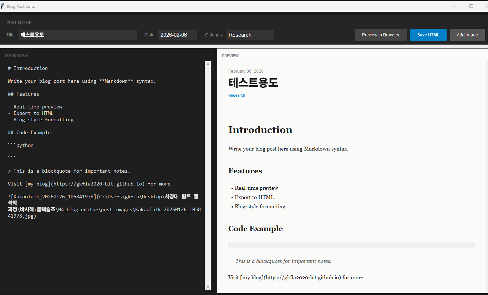

# Blog Post Editor

마크다운으로 블로그 글을 작성하면서 실시간 미리보기를 제공하는 데스크톱 에디터입니다.

## Features

- 📝 마크다운 에디터 (실시간 미리보기)
- 🎨 블로그 스타일 그대로 적용
- 🌐 브라우저에서 미리보기
- 💾 HTML 파일로 저장

## Installation

```bash
pip install markdown
```

## Usage

```bash
python blog_editor.py
```

## Screenshot

- 왼쪽: 마크다운 에디터
- 오른쪽: 실시간 미리보기
- Preview in Browser: 브라우저에서 확인
- Save HTML: HTML 파일로 저장

## Markdown Syntax

```markdown
# Heading 1
## Heading 2
### Heading 3

**bold** and *italic*

- List item
- List item

> Blockquote

\`inline code\`

\`\`\`python
def hello():
    print("Hello!")
\`\`\`

[Link](https://example.com)

```

## Author

Ha Rim Jung - [GitHub](https://github.com/gkfla2020-bit)
